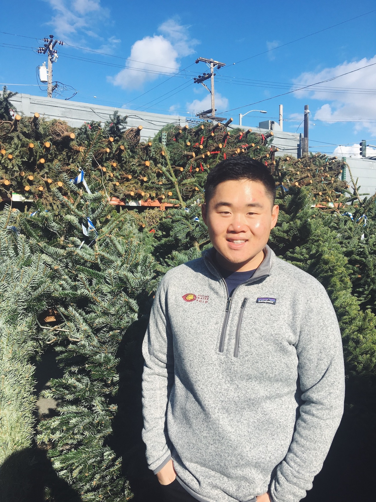

# Introduction

Hello! My name is Austin Lai.

I'm a technical writer, UX content strategist, and content designer living in San Francisco, CA. I graduated from the University of Chicago with a B.A. in Comparative Human Development and moved into the city the week before quarantine \(around March 2020\). 

Since graduating [college](https://collegeadmissions.uchicago.edu/uncommon-blog/adulting-in-college) and returning to the Bay Area after culinary school in London, I've enjoyed recipe testing, aromatherapy, and gardening in my apartment in the Lower Haight. I'm currently serving as the Communications Chair for the UChicago Alumni Club of the Bay Area.

I love candles, house plants, and wine -- my favorite candle right now is [Grapefruit + Mangosteen](https://www.basikcandle.com/collections/candles/products/grapefruit-mangosteen-candle) from Basik, a small San Francisco producer. I'm raising a new baby snake plant and discovered that my mini-fridge is the perfect place to chill sparkling and white wines!  

Prior to quarantine, you could find me at Arizmendi Bakery, Omnivore Bookstore, or Barry's in Castro. 

You can contact me at &lt;austinlai.97@gmail.com&gt; or find me on [GitHub](https://github.com/alai97) and [LinkedIn](https://www.linkedin.com/in/austin-lai/). 



