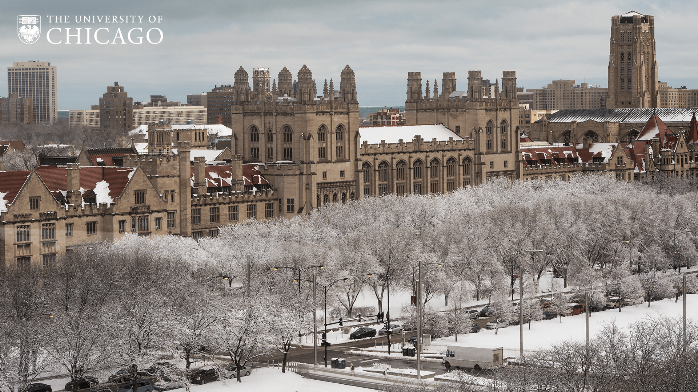

# Portfolio

I am a social science researcher with industry experience in technical writing, content strategy, copywriting, and user research. I studied accessibility politics in design and qualitative/quantitative research methods in cultural anthropology. 

Today, I'm a technical/UX writer writing product documentation and UI content at AppDynamics. I'm  passionate about accessibility, localization, and diversity/inclusion. 

| Experience | Companies | Years |
| :--- | :--- | :--- |
| UX Content Strategy | Cisco, Vinebase, UChicago Admissions | 2018 - present \(3 years\) |
| Technical Writing | AppDynamics, Cisco, Salesforce | 2017 - present \(4 years\) |
| UX Writing | AppDynamics | 2020 - present \(1 year\) |
| Copywriting | AppDynamics, Vinebase, UChicago Admissions | 2018 - present \(3 years\) |
| User Research | AppDynamics, Cisco | 2019 - present \(2 years\) |
| Video Production | Fire Escape Films, Spoon University, UChicago Admissions | 2016 - 2019 \(3 years\) |



