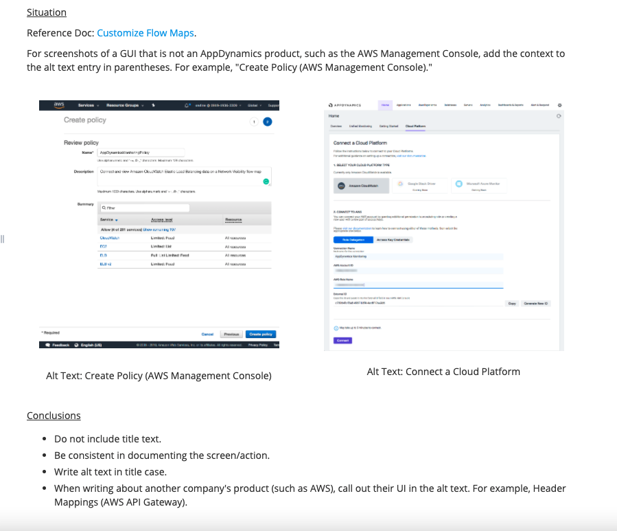

# Content Strategy

**AppDynamics**

* Resolving broken URLs and redirect links in Confluence. 

Because version control is not publically available on Confluence, our doc solution is to create new doc spaces for each major product release \(for example, Controller 4.5, Controller 20.x, and Controller 21.x\).   
  
With multiple doc spaces, redirect links and linking to versioned docs can be tricky \(such as PRO21 links linking to PRO21, not PRO45\). In my content strategy plan, I captured **Incoming Links** and **Outgoing Links** in Confluence and fixed links that were not compatible to the space version.

* Auditing alternative text in Confluence.

Our doc set contains over 1,000 pages with screenshots and diagrams. As part of my accessibility OKR, I audited alt text and documented best practices for writing alternative text. 

