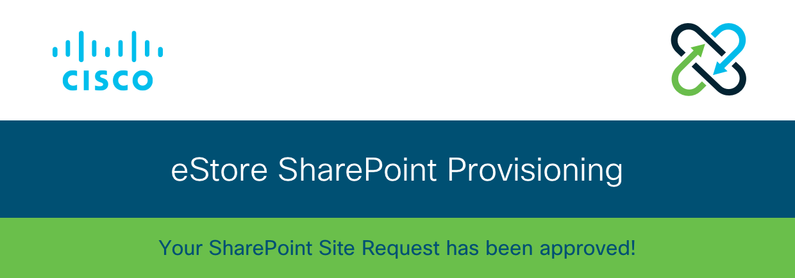

# Email Communications

**UChicago Bay Area Alumni**

* Manage a team of contributing writers on a bi-weekly email newsletter cadence with over 1,500  alumni across the Bay Area.
* Edit draft newsletter submissions, format the newsletter layout, and design call-to-actions \(CTAs\).
* Collaborate with the Chicago Booth Alumni Club of the San Francisco Bay Area Communications Chair on upcoming events, news, and announcements for UChicago alumni.

**Vinebase**



**Cisco**

**Salesforce**



