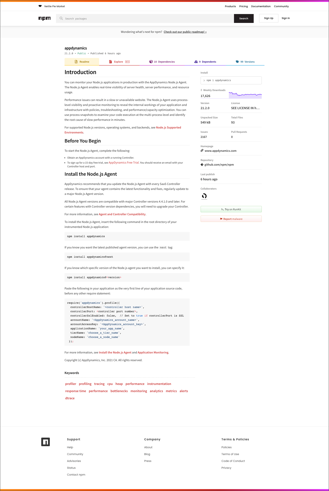
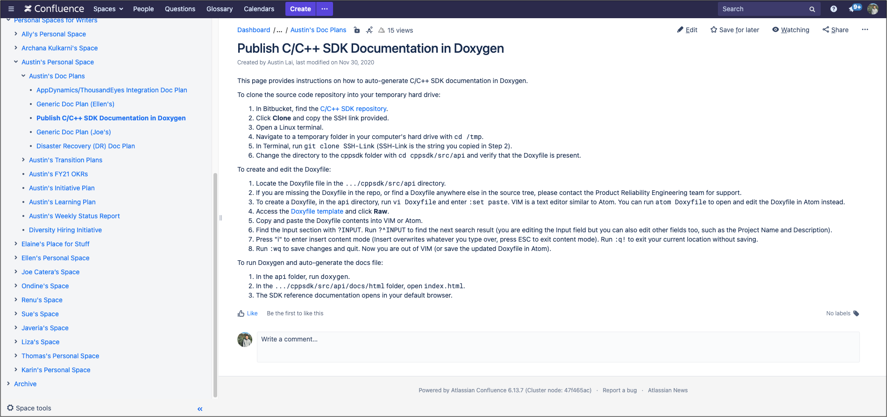
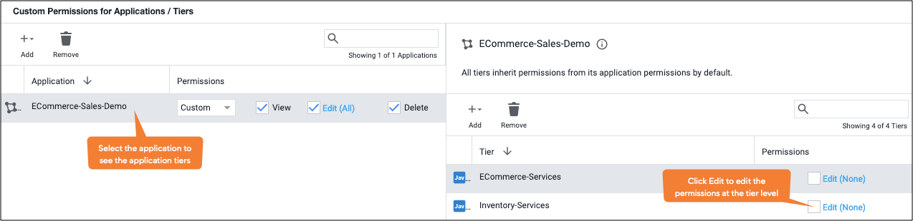
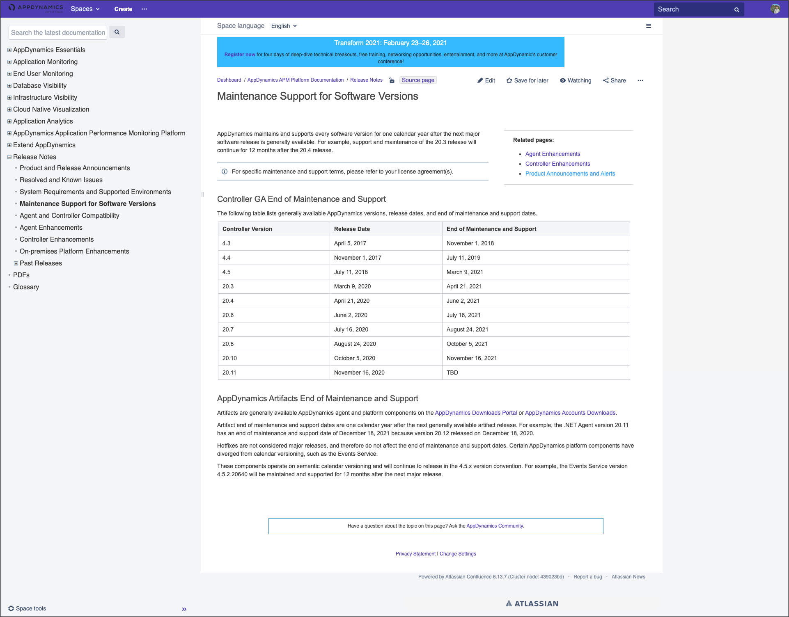
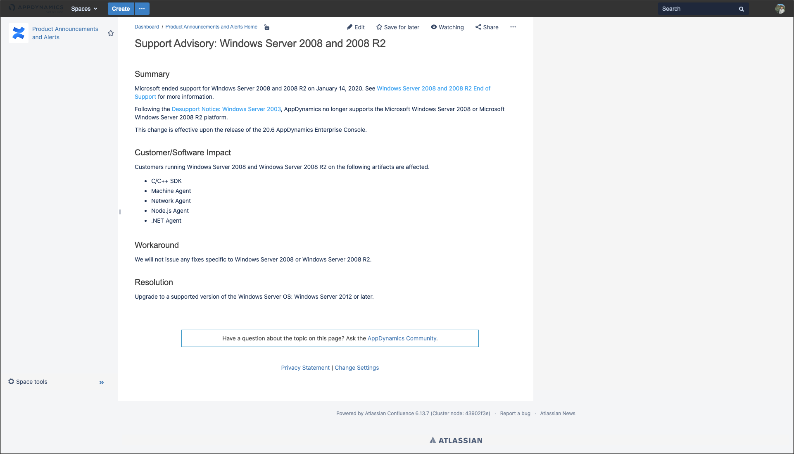
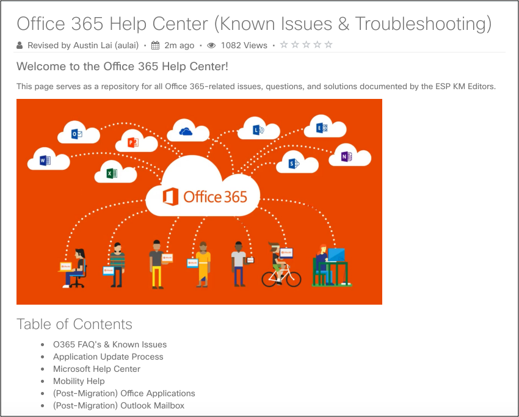
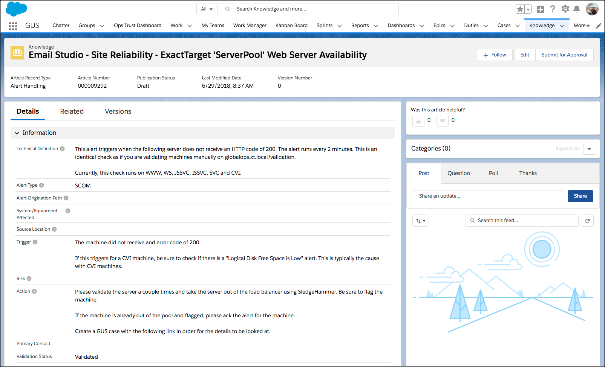

# Technical Writing

**AppDynamics**

* [C/C++ SDK Reference Docs](https://sdkdocs.appdynamics.com/cpp-sdk/21.3/html/)
* Doc Services \(Accessibility Lead, Doc QA Editor, User Feedback Lead\)
* Internal Documentation \(Disaster Recovery Communications, Particle Style Guide\)

**Cisco**

* Borderless Access FAQs
* Remote New Hire Onboarding Guides
* Community Migration of HCL to SharePoint



**Salesforce**

* Incident and Event Management Playbook for Site Reliability Engineering 



