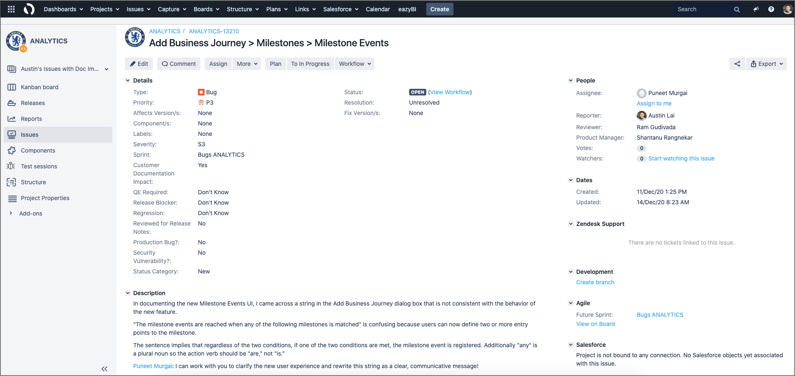
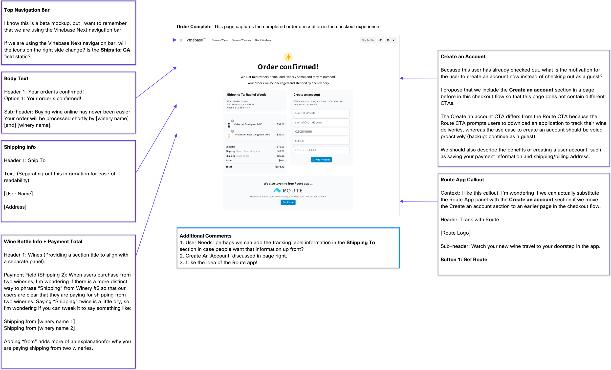
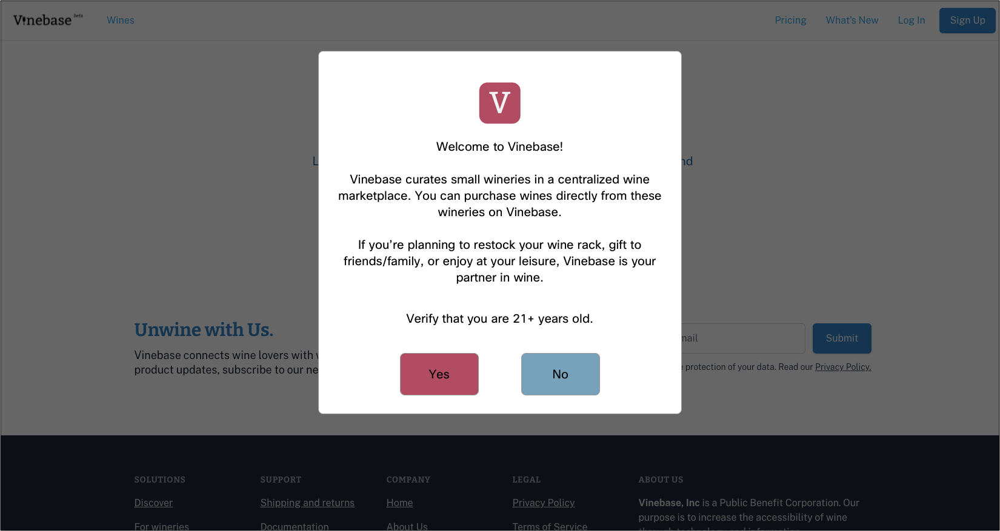
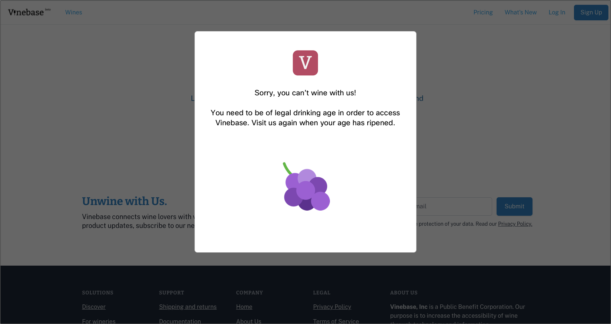
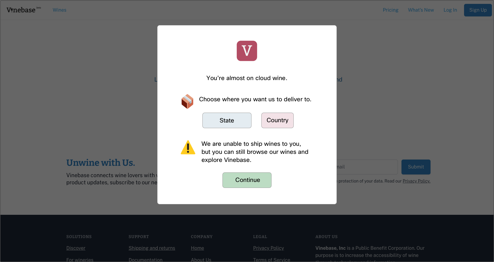
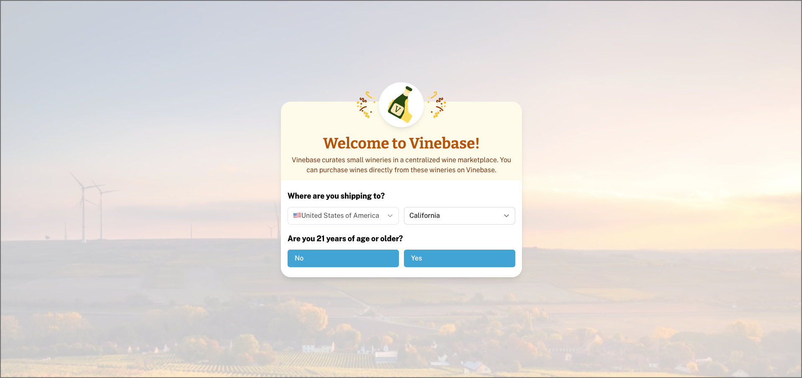
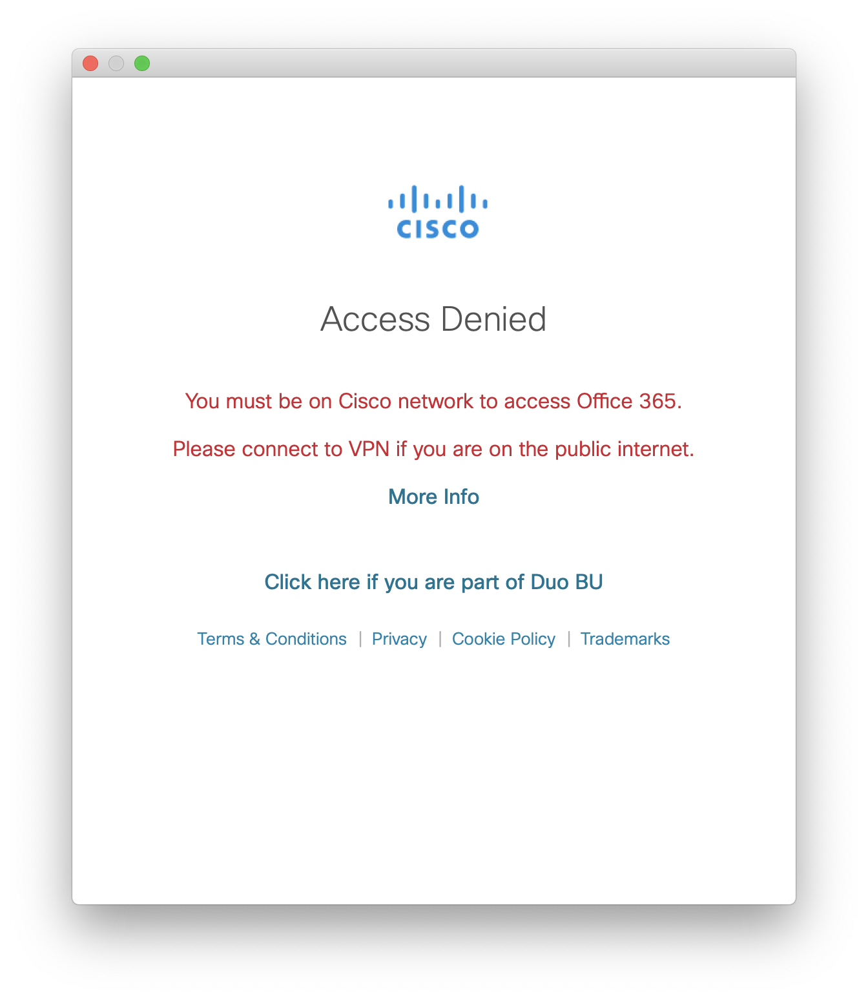
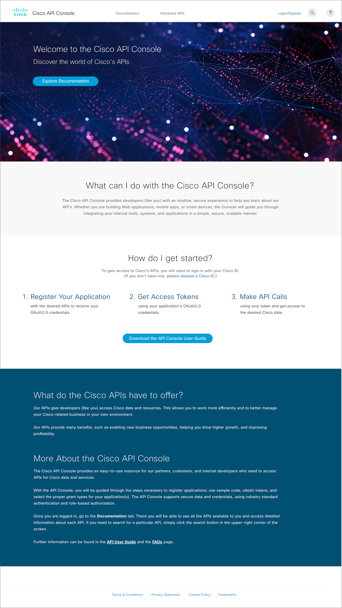
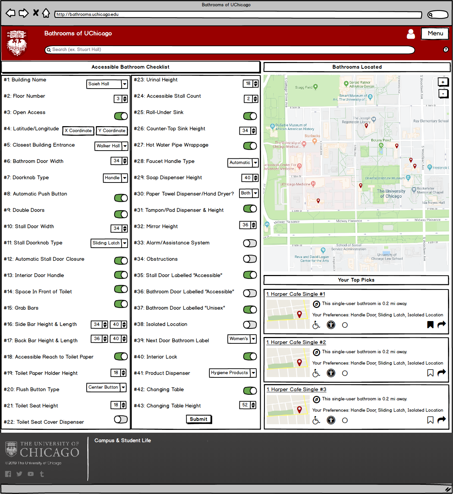

# UX Writing

**Datadog**

I audited the [Docs landing page](https://docs.datadoghq.com) for consistency nits and rewrote microcopy for my 2021 Docs Hackathon project.&#x20;

.png>)

.png>)

**AppDynamics**


UX Writing Style Guide: Capitalization


**Vinebase**


Vinebase Voice and Tone Style Guide



**New User Gate Brainstorm**

I designed the initial mockup and wrote the popover copy for the New User Gate. The user gate is the first screen that a new user sees when they visit Vinebase. It's important that we communicate our company mantra, validate the user's age (21 years old or older), and verify the user's shipping location (Vinebase currently only ships to California).



**New User Gate Age Verification**

I designed this mockup and wrote the microcopy for this error message. If a potential user under 21 years of age visits Vinebase, they are not legally allowed to buy alcohol.&#x20;



**New User Gate Shipping Location**

I designed this mockup and wrote the microcopy for this error message. If a potential user outside of California visits Vinebase, Vinebase is unable to process their orders (until domestic shipping becomes available).&#x20;



**Official New User Gate**

After reviewing the mockups with Product Design and Engineering, we designed a clean, colorful dialogue box to verify a new user's shipping location and age.


**Cisco**

**UChicago Admissions**

.png>)

**Application Development**

