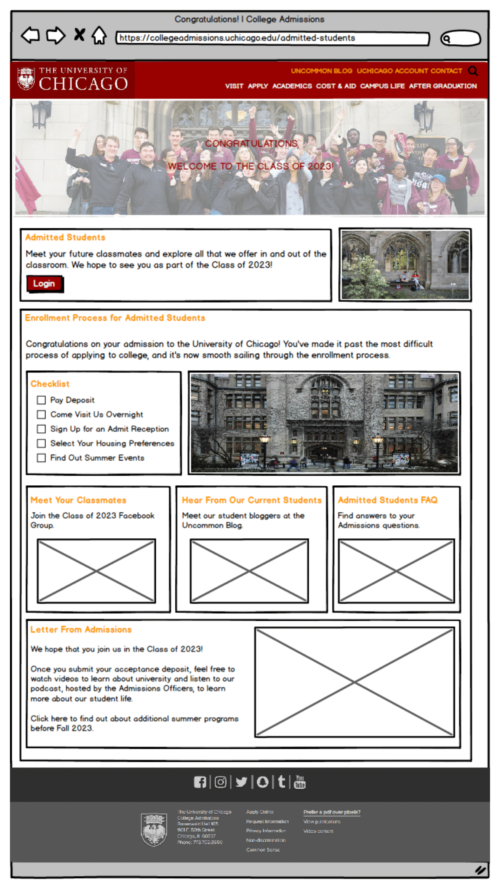

# UX Writing

**AppDynamics**

* UI Content \(including instructional text, dialogue boxes, and microcopy\), UI Engineering Bugs 

**Vinebase**

Mockup Comments in Sketch

Cisco API Console

Before and After

Side-by-side Comparison

**UChicago Admissions**



