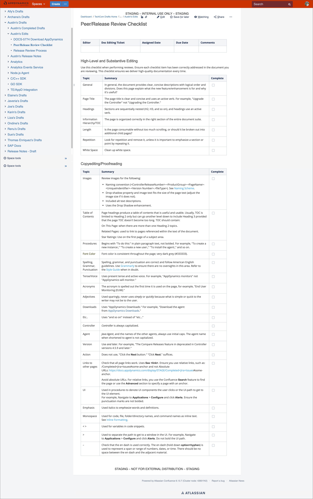

# Consistency Editing

**AppDynamics**

* I lead Doc QA for our major product version releases every six weeks. I project manage and review release notes, resolved issues, and feature documentation before GA. 
* I collaborate with the Doc Editor on a checklist to proofread documentation according to the Documentation Style Guide.

