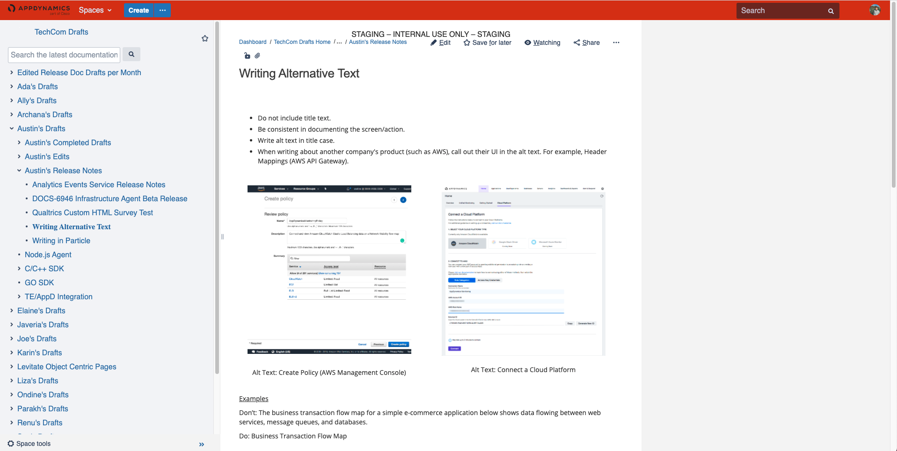

# Consistency Editing

**AppDynamics**

* I lead Doc QA for major product version releases every six weeks. I reviewed release notes, resolved issues, and new feature documentation before GA. 
* I collaborated with the Doc Editor on a checklist to proofread documentation according to the Documentation Style Guide.

